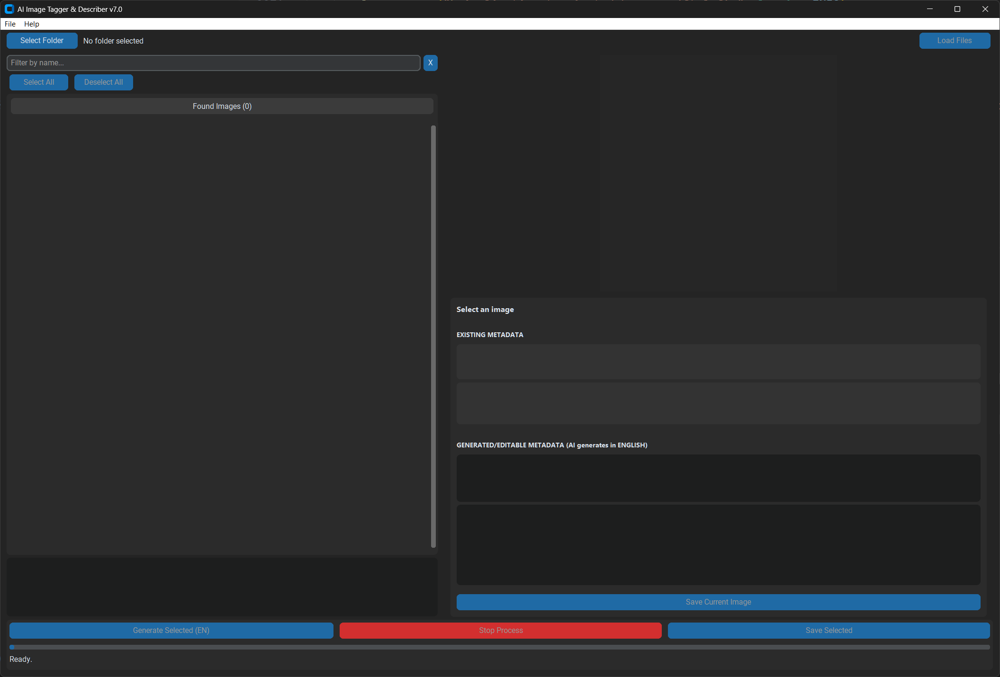

# 📸 AI Image Tagger & Describer 🏷️  
### *Smart metadata for your image library. Automated. Local. Fast.*

---

## 🚀 Overview

**AI Image Tagger & Describer** is a cross-platform desktop application that automatically generates **captions** and **keywords** for your images using AI — and embeds this data into **IPTC/XMP metadata**.

🔍 Ideal for photographers, archivists, and content creators who manage large image libraries.  
🧠 Works offline — your images stay on your machine.

---

## 🌟 Key Features

- 🧠 **AI-Powered Captions & Keywords**  
  Uses Salesforce's BLIP model (Base or Large) via Hugging Face Transformers
- ✍️ **Embedded Metadata**  
  Writes data directly into IPTC and XMP fields inside image files
- 💻 **Cross-Platform**  
  Works on Windows, macOS, and Linux
- 🖼️ **User-Friendly Interface**  
  Features image list, preview panel, and editable metadata fields
- ⚙️ **Fully Customizable Settings**  
  Select AI model, device (CPU/GPU), stop words, and metadata options
- ⚡ **Batch Processing**  
  Tag and save metadata for multiple images in one go
- 📝 **Logging & Error Handling**  
  Includes detailed logs and friendly error messages
- 📦 **Virtual Environment Support**  
  Keeps your dependencies clean and isolated

---

## 🧰 Technologies Used

- `Python 3.9+`
- `CustomTkinter` for GUI
- `Hugging Face Transformers` (BLIP model)
- `PyTorch` (optional for GPU acceleration)
- `iptcinfo3` for IPTC metadata
- `python-xmp-toolkit` and `libexempi` for XMP metadata

---

## 🖥️ Application Interface

### 📂 Image List Panel



- Displays image thumbnails and file names
- Shows processing status indicators
- Checkboxes for batch selection

---

### 🖼️ Detail Panel


- Large preview of the selected image
- Editable caption and keywords
- Save button to update metadata

---

## ⚙️ How It Works

1. **📂 Load Folder** – The app scans a selected directory for supported image files (JPG, JPEG, TIFF).
2. **📖 Read Metadata** – IPTC and XMP metadata is extracted if available.
3. **🤖 AI Tagging** – BLIP generates English captions and keywords.
4. **✍️ Write Metadata** – Results are written back into the image files.

---

## 🔧 Setup Instructions

### ✅ Prerequisites

- **Python 3.9+**
- `pip` (included with Python)
- **Visual C++ Build Tools** (needed if `python-xmp-toolkit` install fails)
- **Exempi** (required for XMP support, auto-installed via Conda or manual)

---

### 🛠️ Installation Guide

```bash
# 1. Clone the repository
git clone https://github.com/yourusername/yourrepository.git
cd yourrepository

# 2. Create a virtual environment
python -m venv .venv

# 3. Activate the virtual environment
# Windows:
.venv\Scripts\activate
# macOS/Linux:
source .venv/bin/activate

# 4. Install dependencies
pip install -r requirements.txt

# 5. Run the application
python main.py
